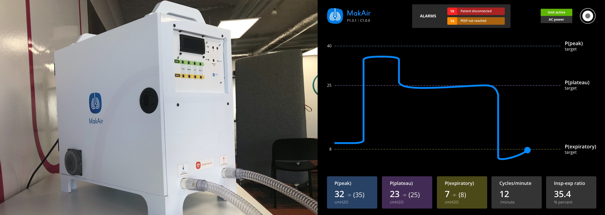

MakAir — Covid-19 Ventilator
=====

**Mass-producible open-source Covid-19 ARDS ventilator. Aims at helping hospitals cope with a possible shortage of professional ventilators during the outbreak. Worldwide.**

We are a distributed team of [200+ contributors](http://makersforlife.fr/) (engineering, medical, regulatory, etc.), mostly spread through France. Makers, developers, university teachers, researchers and medical teams collaborated on this project. Our testing & assembly operations are located in France.

As to ensure international outreach, we made sure that contents required to build your own MakAir ventilator are available in English. The MakAir project has [a website of its own](https://makair.life/).

If you're new there, please read the explanations below. _Your contributions are much welcome!_

---

**Quick introduction video:**

  

---

# Abstract

Roughly, the idea is as follows: as of April 2020 and due to the Covid-19 pandemic, hospitals throughout the world may start lacking mechanical artificial ventilators. We built a pump, and a valve system (controlled by electronics). This way, the breathing cycle can be enforced by proper air routing through the valve system.

Our ventilator is able to handle pressure-controlled breathing, stabilized using a [PID controller](https://en.wikipedia.org/wiki/PID_controller) in the software.

In order to ensure a proper breathing cycle (inhale + exhale), multiple valves need to be connected together to form a circuit. The motors needs to be controlled in harmony so that the air routing between each valve unit is consistent.

This project provides all the parts required to build a good-enough [ARDS](https://en.wikipedia.org/wiki/Acute_respiratory_distress_syndrome) ventilator from mass-produced components. We provide all the required mechanical parts, electronics designs & boards, and firmwares. This ventilator can be 3D-printed and ran on an Arduino board (the maker way), though we **highly advise** that you work with industrial processes as to mold medical-grade plastic parts and assemble the whole ventilator (this would be required for the built ventilator to pass all medical certifications).

We target a per-unit cost well under 500 EUR, which could easily be shrunk down to 200 EUR or even 100 EUR per ventilator given proper economies of scale, as well as choices of cheaper on-the-shelf components (eg. servomotors).

Mechanically-speaking, the overall system is composed of sub-components that can be plugged together and wired to form an air circuit, namely:

- **Air pump** (called "Blower");
- **Air pump casing fit** (called "Blower Holder");
- **Valve system** (called "Pressure Valve");
- **Oxygen Mixer valve** (called "Oxygen Mixer");
- **Air filter casing (patient variant)** (called "Patient Filter Box");
- **Air filter casing (machine variant)** (called "Machine Filter Box"; intake + outtake);
- **Connectors** (called "Pneumatic Connectors");
- **Fan support** (called "Fan Holder");

All those components are fitted in box (ie. a casing) that we designed:

- **Housing container** (called "Casing");

# ⚠️ Warning Notices

**A few important words before you start:**

1. Though 3D-printing (FDM and SLA) can be used to build your own ventilator — this will definitely not scale well to mass-produce MakAir ventilators, and parts might be brittle or leak air. Please work with proper industrial methods and processes if you want to build your own MakAir ventilators.

2. As ARDS patients are sedated, their breathing cycle is forced by mechanical ventilation, while they are intubated. A failing ventilator (due to bad mechanics, pneumatics or software) could kill the patient (O2 desaturation), or permanently damage their lung alveoli (overpressure). It is critical that any self-built MakAir ventilator is tested against a lung simulator system (eg. [ASL 5000](https://www.ingmarmed.com/product/asl-5000-breathing-simulator/)), and validated by medical experts.

3. Medical-grade plastic should be used to produce ventilators, and any kind of grease or adhesive chemicals must be avoided in the ventilator. The ventilators should be produced in a [cleanroom](https://en.wikipedia.org/wiki/Cleanroom) as to avoid dust & germ contaminations.

4. The pneumatic circuit should be thoroughly tested for leaks and its ability to withstand elevated positive air pressure. Joints should be used where relevant, and medical-grade flexible pipes should be used between components.

5. While the MakAir ventilators produced on-site in France were validated by a medical & engineering board, you should independantly seek validation of the MakAir ventilators that you produce; as your assembly methods or parts may vary with ours.

_MakAir and Makers For Life should not be held resposible — at any time, for harm caused to human life (eg. lung damage or loss of life). By building your own MakAir, you are held responsible for its safety validations & use._

# Projects

As the MakAir ventilator project grew up to be quite large, it is split up in sub-repositories (eg. firmware, PCB designs, etc.):

* **[makair-firmware](https://github.com/makers-for-life/makair-firmware)**: The firmware software source code and builds, that runs on the motherboard;
* **[makair-control-ui](https://github.com/makers-for-life/makair-control-ui)**: The control user interface, that shows realtime graphs of the ventilator while running, on a LCD display;
* **[makair-telemetry](https://github.com/makers-for-life/makair-telemetry)**: The telemetry library (and CLI tool), used as a protocol bridge between the Firmware and Control UI;
* **[makair-motherboard](https://github.com/makers-for-life/makair-motherboard)**: The motherboard electronics and PCB design;
* **[makair-parts](https://github.com/makers-for-life/makair-parts)**: The mechanical parts that can be 3D-printed and assembled to build the pneumatic circuit;
* **[makair-casing](https://github.com/makers-for-life/makair-casing)**: The MakAir casing which houses all electronics and pneumatics;

# How To Build?

This section aims at introducing you on how to manufacture your own MakAir — _the 3D-printed way_. In other words, we will explain there how to build a DIY MakAir using on-the-shelf parts and 3D printers.

## 1️⃣ Print all the parts

In order to 3D-print your MakAir, please first ensure you have access to a [SLS](https://en.wikipedia.org/wiki/Selective_laser_sintering) 3D printer at best (eg. [HP Multi Jet Fusion](https://www8.hp.com/us/en/printers/3d-printers/products/multi-jet-technology.html)), or otherwise a [SLA](https://en.wikipedia.org/wiki/Stereolithography) printer (eg. [Formlabs Form 3](https://formlabs.com/3d-printers/form-3/)). If you want to use a [FDM](https://en.wikipedia.org/wiki/Fused_filament_fabrication) printer (eg. [MakerBot Method](https://www.makerbot.com/3d-printers/method/)), please note that some precise parts have been optimized for SLA or SLS printing. Some parts may not print well using FDM printers, even on decent hardware.

**👉 To sum up:** at best, use a SLS metal printer, else, use a SLA resin printer. If you do not have access to either of these, you may fallback on a FDM filament printer (using [PLA](https://en.wikipedia.org/wiki/Polylactic_acid) or [ABS](https://en.wikipedia.org/wiki/Acrylonitrile_butadiene_styrene) filaments).

### 1. Parts

You can find a list of all parts that should be 3D-printed, as well as the number of parts that should be printed for each one (pick the last active version for each part):

- 1 x **Blower** — Print [all STL parts](https://github.com/makers-for-life/makair-parts/tree/master/src/blower/printing/stl) using the same printer (SLA or SLS; FDM discouraged; 50 microns minimum);
- 2 x **Pressure Valve** — Print [all STL parts](https://github.com/makers-for-life/makair-parts/tree/master/src/pressure-valve/printing/stl) using the same printer (SLA, SLS or FDM; 200 microns minimum);
- 1 x **Oxygen Mixer** — Print [the STL part](https://github.com/makers-for-life/makair-parts/tree/master/src/oxygen-mixer/printing/stl) (SLA or SLS; FDM discouraged; 100 microns minimum);
- 1 x **Patient Filter Box** — Print [all STL parts](https://github.com/makers-for-life/makair-parts/tree/master/src/patient-filter-box/printing/stl) using the same printer (SLA, SLS or FDM; 100 microns minimum);
- 1 x **Machine Filter Box (Intake)** — Print [all STL parts](https://github.com/makers-for-life/makair-parts/tree/master/src/machine-filter-box/printing/stl) using the same printer, make sure that you pick the proper sub-part (SLA or SLS; FDM discouraged; 100 microns minimum);
- 1 x **Machine Filter Box (Outtake)** — Print [all STL parts](https://github.com/makers-for-life/makair-parts/tree/master/src/machine-filter-box/printing/stl) using the same printer, make sure that you pick the proper sub-part (SLA or SLS; FDM discouraged; 100 microns minimum);
- 1 x **Pneumatic Connectors (Blower)** — Print [the STL part](https://github.com/makers-for-life/makair-parts/tree/master/src/pneumatic-connectors/printing/stl) using the same printer, make sure that you pick the proper sub-part (SLA or SLS; FDM discouraged; 100 microns minimum);
- 1 x **Pneumatic Connectors (O2)** — Print [the STL part](https://github.com/makers-for-life/makair-parts/tree/master/src/pneumatic-connectors/printing/stl) using the same printer, make sure that you pick the proper sub-part (SLA or SLS; FDM discouraged; 100 microns minimum);
- 1 x **Pneumatic Connectors (No Pressure)** — Print [the STL part](https://github.com/makers-for-life/makair-parts/tree/master/src/pneumatic-connectors/printing/stl) using the same printer, make sure that you pick the proper sub-part (SLA or SLS; FDM discouraged; 100 microns minimum);
- 1 x **Pneumatic Connectors (Pressure)** — Print [the STL part](https://github.com/makers-for-life/makair-parts/tree/master/src/pneumatic-connectors/printing/stl) using the same printer, make sure that you pick the proper sub-part (SLA or SLS; FDM discouraged; 100 microns minimum);

If you are using your own proprietary blower — _in addition to the parts above_ — please adjust the [Blower Holder](https://github.com/makers-for-life/makair-parts/tree/master/src/blower-holder) CAD model and print it as well (this one prints well using a FDM printer at worst).

### 2. Casing

Now that you got all parts printed, you may assemble them in the MakAir casing box. We recommend that you build the casing using laser-cut acrylic panels. You may find the casing CAD model for [Fusion 360](https://github.com/makers-for-life/makair-casing/tree/master/src/fusion) or as a [STEP file](https://github.com/makers-for-life/makair-casing/tree/master/src/step).

_Please ensure that you cut your acrylic panels using the same sizes than stated on our models; as those sizes are optimized to contain all required parts and electronics in the minimum amount of space._

## 2️⃣ Setup the electronics

Electronics are comprised of two parts: the firmware controller board (typically, an Arduino), and the "raw" PCB electronics (LCD, interface buttons, alarm beeper, etc.). Those parts make up the motherboard, on the top of which a rigid panel is mounted, and user instructions are printed (eg. control button bindings).

### 1. Motherboard

The motherboard electronic schematics and wiring diagrams [can be found there](https://github.com/makers-for-life/makair-motherboard/tree/master/src/schematics). Please pick the last version available.

👋 _If you need help on this step, you may [open an issue](https://github.com/makers-for-life/makair-motherboard/issues/new)._

### 2. Control Unit Screen

The control unit is made of a [Raspberry Pi 4](https://www.raspberrypi.org/products/raspberry-pi-4-model-b/) computer, plugged to a [Raspberry Pi Touch Display](https://www.raspberrypi.org/products/raspberry-pi-touch-display/).

👋 _If you need help on this step, you may [open an issue](https://github.com/makers-for-life/makair-control-ui/issues/new)._

## 3️⃣ Flash the firmware

### 1. Ventilator Firmware

Now that both mechanical parts and electronics are ready, you may flash the latest MakAir firmware binary on your firmware controller board (Arduino, ST Nucleo, or other).

Firmware release binaries are available for download on our [releases page](https://github.com/makers-for-life/makair-firmware/releases).

👋 _If you need help on this step, you may [open an issue](https://github.com/makers-for-life/makair-firmware/issues/new)._

### 2. Control Unit Runtime

The Control Unit should be built and ran on the Raspberry Pi 4 using instructions available on the [Control Unit](https://github.com/makers-for-life/makair-control-ui) documentation.

👋 _If you need help on this step, you may [open an issue](https://github.com/makers-for-life/makair-control-ui/issues/new)._

# Schemes

## Pneumatic Circuit Scheme

_(design by [Valerian Saliou](https://github.com/valeriansaliou))_

## Casing Layout

### Top Part: Electronics (Power & Controllers)

_(design by Arthur Dagard; drawing by [Valerian Saliou](https://github.com/valeriansaliou); remake by [Lāsma Fedotova](https://github.com/lasmafedotova))_

### Bottom Part: Pneumatics

_(design by Arthur Dagard; drawing by [Valerian Saliou](https://github.com/valeriansaliou); remake by [Lāsma Fedotova](https://github.com/lasmafedotova))_

# News & Contact

## Updates

* Live updates on Telegram: [join "Newsroom MakAir (Covid-19 Ventilator)"](https://t.me/joinchat/AAAAAE_99-k7pKZur-GXCQ)
* YouTube channel: [view "MakAir" on YouTube](https://www.youtube.com/channel/UCcf_3KXjeJSMz39J6gsyTSg)
* Coordination on Slack: [request to join "Makers For Life"](https://github.com/makers-for-life/makair/issues/new) (open an issue)

## Contacts

* Open-source & questions: [please open an issue on GitHub](https://github.com/makers-for-life/makair/issues/new)
* Press contacts: [Grégory Thibord](https://twitter.com/thibord) ([email](mailto:gregory.thibord@lepalace.work))
* Medical contacts: [Pierre Antoine Gourraud](http://www.itun.nantes.inserm.fr/Team-5/Pierre-Antoine-Gourraud) ([email](mailto:pierre-antoine.gourraud@univ-nantes.fr))
* Industry relations: [Quentin Adam](http://waxzce.org/) ([email](mailto:quentin.adam@clever-cloud.com))
* Engineering contact (mechanics): [Valerian Saliou](https://valeriansaliou.name/) ([email](mailto:valerian@valeriansaliou.name))
* Engineering contact (software): [David Sferruzza](https://david.sferruzza.fr/) ([email](mailto:david.sferruzza@gmail.com))
* Engineering contact (electronics): Vincent Le Cunff ([email](mailto:v.lecunf@gmail.com))

# Sponsors & Contributors

This project would not have been possible without the support of those companies and organizations, which have put human, real estate and/or financial resources at work on the project:

* [Clever Cloud](https://www.clever-cloud.com/) (founding team)
* [Crisp](https://crisp.chat/) (founding team)
* [Cooprint](https://cooprint.fr/) (CAD)
* [SenX](https://senx.io/) (electronics)
* [Tronico](https://www.tronico-alcen.com/) (PCB design)
* [Renault Group](https://www.renault.fr/) (manufacturing)
* [SEB Group](https://www.groupeseb.com/) (manufacturing)
* [Le Palace Nantes](https://lepalace.work/) (team offices)
* [Parrot](https://www.parrot.com/) (hardware provider)
* [STMicroelectronics](https://www.st.com/) (hardware provider)
* [Diabeloop](https://www.diabeloop.com/) (regulatory help)
* [Legrand](https://www.legrand.fr/) (hardware provider)
* [RTsys](https://rtsys.eu/) (engineering provider)

We are supported by public entities as well, namely:

* [Defence Innovation Agency](https://www.defense.gouv.fr/) (Ministry of Armed Forces of France)
* [CEA](http://www.cea.fr/) (France)
* [CHU of Nantes](https://www.chu-nantes.fr/) (France)
* [University of Nantes](https://www.univ-nantes.fr/) (France)
* [City of Nantes](https://metropole.nantes.fr/) (France)
* [Region of Auvergne-Rhône-Alpes](https://www.auvergnerhonealpes.fr/) (France)

Adding to that, 200+ individual members of the project who contributed to technical, legal, medical and press subjects (and more).

# Press Coverage

## 📺 TV

* [France 3, 21st April 2020](https://www.youtube.com/watch?v=M3QLCvUyIII) (French-speaking)
* [TF1, 26th April 2020](https://www.youtube.com/watch?v=2X157RLbRIA) (French-speaking)
