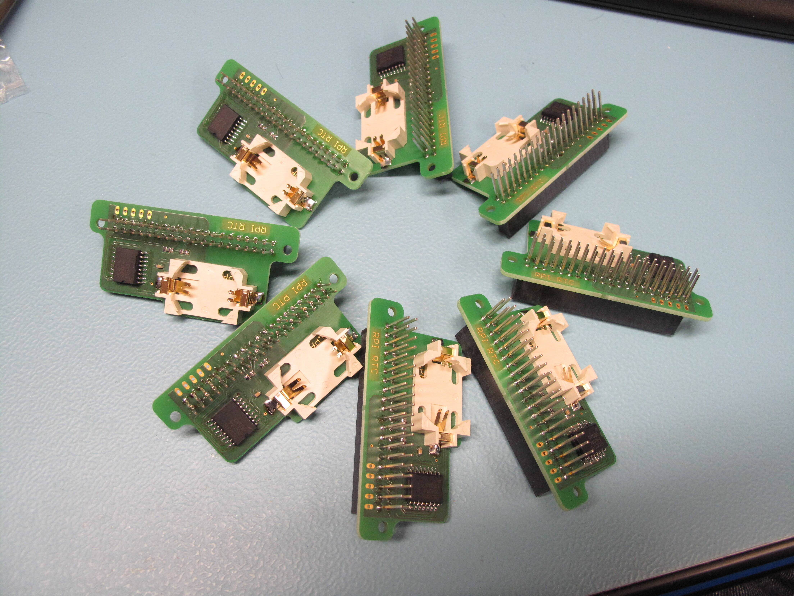

# Motherboard electronics was moved in other repositories

| Electronics | New repo |
| --- | --- |
| Motherboard | [makair-motherboard](https://github.com/makers-for-life/makair-motherboard) |

# SFM3300 adapter


This little board provide a convenient way to interface a Sensirion SFM3300 to the red micromatch connector of the Motherboard.

As soon I2C clock remains low, the sensor is shutdown. This allows easy hard reset. 

# Rpi RTC



This RTC HAT was designed to avoid any conflict between Raspberry touchscreen and RTC. All the RTC you can find are connected on SDA3/SCL3 of the Raspberry 4. But the touchscreen is already connected to this port, and there is some random issues. 

So, this small board is designed to connect a DS3231 on I2C6 of the Raspberry 4 (pin 15 and 16).

## How to setup RTC on I2C6 of Raspberry 4

Make sure the Rpi is up to date:

```
sudo apt update
sudo apt upgrade
sudo reboot
sudo rpi-update
```

- Add to /boot/config.txt:

`dtoverlay=i2c6`

- Make a new dts from existing rtc one (named i2c6-rtc)

`sudo dtc -I dtb -O dts /boot/overlays/i2c-rtc.dtbo -o /boot/overlays/i2c6-rtc.dts`

- Edit it to change i2c_arm to i2c6 

`sudo sed -i "s/i2c_arm/i2c6/g" /boot/overlays/i2c6-rtc.dts`

- Recompile it

`sudo dtc -I dts -O dtb /boot/overlays/i2c6-rtc.dts -o /boot/overlays/i2c6-rtc.dtbo`

- add to /boot/config.txt

`dtoverlay=i2c6-rtc,ds3231`


After reboot, check dmesg:
```
dmesg | grep rtc
[    5.883603] rtc : registered as rtc0
```

If battery is low :
```
[  42.117539] rtc: low voltage detected, time is unreliable
```

Now write current time into the RTC :
make sure your Rpi clock is synchronized, using `date`, then `sudo hwclock -w` to write current date into the rtc.


On Arch Linux, you have to create a script on startup to read RTC time during the boot:
```
cat > /etc/systemd/system/rtc.service << ENDRTCSERVICE
[Unit]
Description=RTClock
Before=network.target
 
[Service]
ExecStart=/usr/bin/hwclock -s
Type=oneshot
[Install]
WantedBy=multi-user.target
ENDRTCSERVICE
```

Then enable this service:
```
systemctl enable rtc
systemctl start rtc
```

Reboot, then check everything is OK
```
journalctl -u rtc
```


